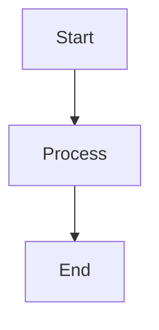
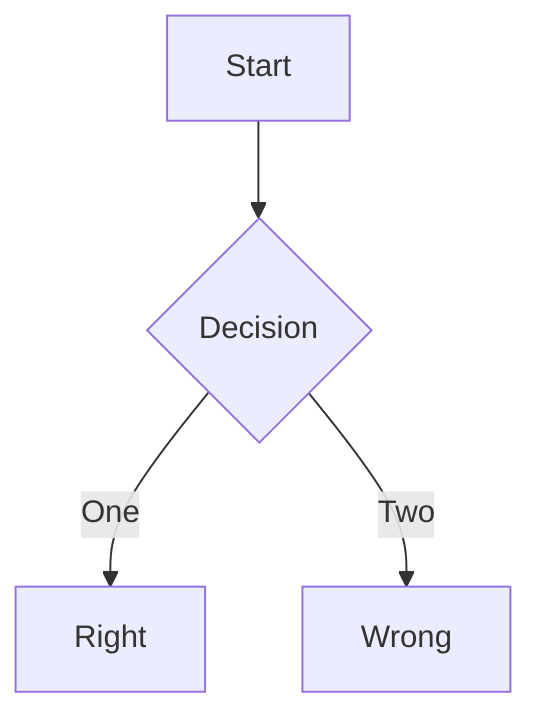
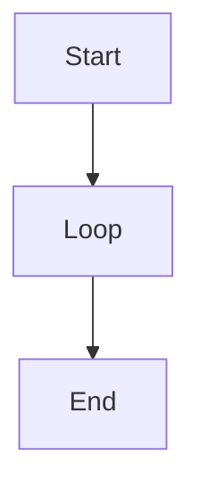
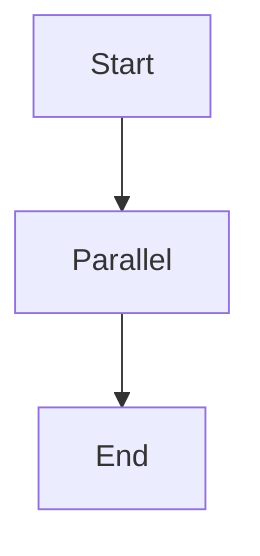

## Process
Process is a sequence of activities that are performed to achieve a specific goal.

## Decision
Decision is a process that allows to make a decision based on a condition.

## Loop
Loop is a process that allows to repeat a process.

## Parallel
Parallel is a process that allows to perform multiple processes at the same time.
