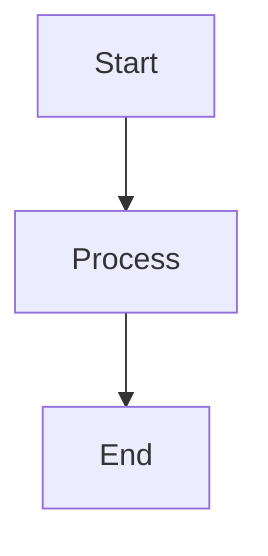
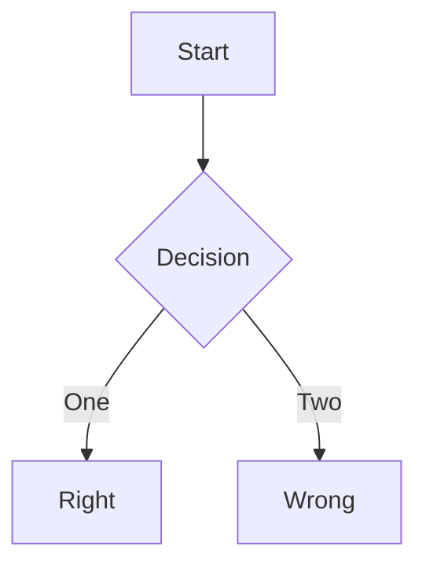
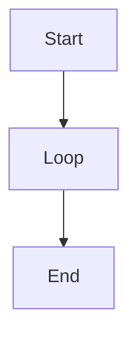
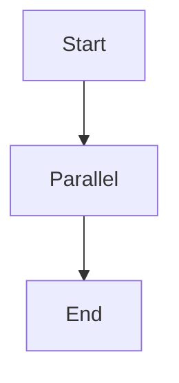

## Process

```mermaid
graph TD
    A[Start] --> B[Process]
    B --> C[End]
```

## Decision

```mermaid
graph TD
    A[Start] --> B{Decision}
    B -->|One| C[Right]
    B -->|Two| D[Wrong]
```

## Loop

```mermaid
graph TD
    A[Start] --> B[Loop]
    B --> C[End]
```

## Parallel

```mermaid
graph TD
    A[Start] --> B[Parallel]
    B --> C[End]
```